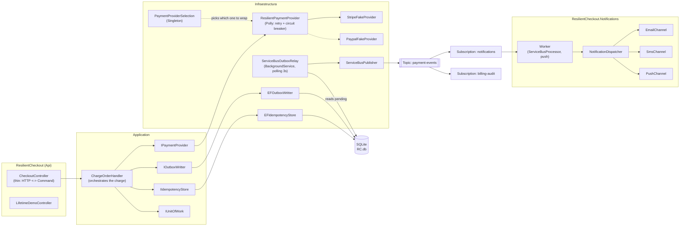

# ResilientCheckout

Personal portfolio project built to reinforce, with real code and not just theory, four points that came up weak in a technical interview (DI lifetimes, resilience with Polly, Circuit Breaker, and Azure Service Bus) together with patterns that were already mastered but are worth demonstrating with a concrete case (idempotency, Transactional Outbox, Strategy).

The domain is deliberately simple — a charge endpoint with fake payment providers — so that all the complexity sits in the resilience and messaging infrastructure, which is the real goal of the exercise.

## Architecture

Clean Architecture with four projects plus one extra:

- **`ResilientCheckout.Domain`** — zero external dependencies. Entities (`PaymentResult`, `OutboxMessage`, `IdempotencyRecord`), and the abstractions the domain itself needs to express (`IPaymentProvider`, `PaymentProviderUnavailableException`).
- **`ResilientCheckout.Application`** — references only Domain. Commands (`ChargeCardCommand`) and the infrastructure abstractions Application needs but doesn't implement (`IIdempotencyStore`, `IOutboxWritter`, `IUnitOfWork`, `IEventPublisher`).
- **`ResilientCheckout.Infraestructure`** — references Application and Domain. All the concrete implementations: EF Core, Polly, Azure Service Bus, the fake payment providers.
- **`ResilientCheckout` (`ResilientCheckout.Api.csproj`)** — references the three above. Composition root: controllers, `Program.cs` with all the DI registration.
- **`ResilientCheckout.Notifications`** — separate process (Worker Service). Only references Domain (the `INotificationChannel`/`NotificationRequest` contracts) — never Application or Infraestructure, because it doesn't share anything from the checkout flow, it only consumes already-published events.

## Running it locally

1. **Azure Service Bus emulator** (Docker): `docker compose up -d` from the repo root. Brings up the official emulator + its backing SQL Edge, with the `payment-events` Topic and the `notifications`/`billing-audit` Subscriptions already defined in `servicebus-emulator/Config.json`.
2. **EF Core migrations** (first time, or if the entities changed): `dotnet ef database update --project ResilientCheckout.Infraestructure --startup-project ResilientCheckout`.
3. **Api**: `dotnet run --project ResilientCheckout`.
4. **Notifications worker** (separate process, separate terminal): `dotnet run --project ResilientCheckout.Notifications`.
5. **Tests**: `dotnet test` (or Test Explorer in Visual Studio).

To debug both processes (Api + Notifications) at once from Visual Studio, use *Configure Startup Projects* and mark both as *Start* — but to be able to stop just one (as in the "message is never lost" demo below) it's more practical to run them in two separate terminals with `dotnet run`.

## Main endpoints

| Endpoint | What it does |
|---|---|
| `POST /api/checkout/{orderId}/charge` | Charges an order. Requires the `Idempotency-Key` header. |
| `POST /api/simulation/{mode}` | Changes the mode of the currently ACTIVE fake payment provider: `Success`, `TransientFailure`, `PersistentFailure`. |
| `POST /api/simulation/provider/{provider}` | Hot-switches which provider is active: `Stripe` or `Paypal`. |
| `GET /api/lifetime-demo` | Compares Singleton/Scoped/Transient with real Guids — see the lifetimes section below. |

## Architecture decisions and why

### Domain can't depend on Application

`IPaymentProvider` originally received a `ChargeCardCommand` (an Application type) — that forced Domain to reference Application, inverting the dependency direction Clean Architecture requires. It was fixed by creating `ChargeInstruction`, a minimal DTO inside Domain with only what the payment provider needs (`OrderId`); `ChargeCardCommand.ToChargeInstruction()` does the mapping on the Application side, which can know about Domain.

### Idempotency: reserve first, don't check-then-act

The first version checked "does this key exist?" and, if not, created it — a classic race condition between the check and the write under concurrent load. It was redesigned as *reserve-first*: `TryReserveAsync` tries to insert directly and lets the database's unique constraint (`Key` as the primary key) be the arbiter. If another request already reserved that key, `SaveChangesAsync` throws `DbUpdateException`, which is caught and translated into `false`. The database decides, not an in-memory condition that can lose the race.

Also, the key is only released (`ReleaseAsync`) when the operation **never truly completed** (circuit open, provider unavailable after retries) — never when the outcome was a business rejection (`Succeed = false`). A business rejection is a valid outcome and the key must stay consumed; a technical failure shouldn't burn the chance to retry with the same key.

### Transactional Outbox + Unit of Work

Writing the idempotency record, the `OutboxMessage`, and confirming the charge are three operations that must be atomic: if one fails, none should persist. `IUnitOfWork` abstracts a single `SaveChangesAsync()` over the same Scoped `AppDbContext` shared across the whole request — the real atomicity guarantee comes from EF Core (its `DbContext` is already a Unit of Work), but the interface decouples Application/Api from knowing about EF Core directly.

The outbox solves the problem of "how do I guarantee the successful-payment event gets published, even if the message broker is down at that exact instant?" — the event is saved in the same transaction as the rest of the charge, and a separate process (`ServiceBusOutboxRelay`) takes care of getting it out to Service Bus whenever it can.

### Polly: retry + circuit breaker combined

`ResiliencePolicies.CreatePaymentProviderPipeline` combines both strategies into a single `ResiliencePipeline<PaymentResult>` (Polly v8, not the `Policy`-based v7). Only `PaymentProviderUnavailableException` — an owned, controlled exception — is retried and counted as a failure, never a generic `Exception`, because that would include real programming bugs that shouldn't be retried or trip the circuit. A business rejection (`Succeed = false`) doesn't count as a failure for Polly either: technically the provider responded fine, it just said "no".

### Command + Handler, no mediator: a controller that doesn't orchestrate

The original plan considered Wolverine for CQRS (`Commands` + `Handlers` folder). The decision was made not to adopt it: the four points this project exists to reinforce (lifetimes, Polly, Circuit Breaker, Service Bus) don't include mediator libraries, and Wolverine brings its own integrated Transactional Inbox/Outbox — adopting it halfway would have competed directly with the outbox already hand-built in M2/M4 (or replaced that demonstration, or coexisted unused, which looks worse than not having it at all).

What was kept from the original plan, without the framework: separating the Command from the Handler. Before, `CheckoutController.Charge` received all four dependencies (`IPaymentProvider`, `IIdempotencyStore`, `IOutboxWritter`, `IUnitOfWork`) and orchestrated the reservation, the charge, the exception handling, and the outbox — a controller that was, in practice, a use case disguised as an HTTP action. Now `ChargeOrderHandler` (Application) concentrates all that orchestration and returns a neutral `ChargeOrderResult` (an `Outcome` enum + data) that knows nothing about HTTP; the controller was reduced to validating the shape of the request and translating that result into a status code. The concrete benefit: `ChargeOrderHandler` is tested without `HttpContext`, without `ControllerContext`, without any ASP.NET Core at all — and if a mediator (Wolverine or another) is ever adopted, this is exactly the class it would end up invoking.

Along the way, this refactor uncovered a coupling worth fixing: the controller was catching `BrokenCircuitException` (a **Polly** type) directly, which meant even the Api layer knew an Infraestructure implementation detail. That translation was moved into `ResilientPaymentProvider` itself: it now catches `BrokenCircuitException` internally and rethrows it as `PaymentProviderUnavailableException` (a **Domain** type). The result is that `ChargeOrderHandler` — and anything else outside Infraestructura — only needs to know a single exception type for "the provider isn't available right now", regardless of whether the cause was exhausted retries or an already-open circuit.

### Real Strategy: Paypal selectable at runtime (and dead-domain cleanup)

`PaypalFakeProvider` had existed since M1 but was never registered — dead code that only proved `IPaymentProvider` *could* have a second implementation, not that it actually did. This was resolved with `PaymentProviderSelection` (Singleton, same reasoning as `PaymentSimulationOptions`): it holds which provider is active, starts from the value in `appsettings.json` (`Payments:Provider`), and can be hot-switched via `POST /api/simulation/provider/{provider}`, without restarting the app. The `IPaymentProvider` factory in `Program.cs` reads that selection and decides which concrete fake to wrap with the Polly decorator — resilience is indifferent to which provider sits behind it, because it decorates the interface, not a concrete class. Now it's genuinely a demonstrable Strategy: two real implementations, swappable without recompiling.

`PaypalFakeProvider` was also made symmetric with `StripeFakeProvider`: both receive the same `PaymentSimulationOptions` (Singleton) and throw `PaymentProviderUnavailableException` when it's time to fail. It's deliberate that they share a single simulation instance instead of one per provider — the failure switch is "whichever provider is active right now", not a specific one, so switching from Stripe to Paypal mid-way through a resilience demo doesn't require reconfiguring anything.

Along the way, `ResilientCheckout.Domain/Orders/` (`Order`, `OrderStatus`) was retired: a whole entity that was never persisted (no `DbSet`, no migration, no controller) whose only point of contact was a navigation property on `PaymentResult` that the fakes never populated — domain modeled early on that ended up orphaned. It was removed along with the `PaymentResult.Order` property.

### DI lifetimes — the thread running through the whole project

- **Scoped**: `AppDbContext` and everything that depends directly on it (`EFIdempotencyStore`, `EFOutboxWritter`, `EFUnitOfWork`, `ResilientPaymentProvider`/`StripeFakeProvider`/`PaypalFakeProvider`), plus `ChargeOrderHandler` (Application) — it wouldn't make sense for it to live longer than the Scoped dependencies it orchestrates.
- **Singleton**: Polly's `ResiliencePipeline<PaymentResult>` (the circuit breaker keeps its state — Closed/Open/Half-Open — *inside* the pipeline; a new one per request could never open the circuit), `ServiceBusClient`/`IEventPublisher` (they keep the AMQP connection alive), and `PaymentSimulationOptions` (the simulation state must survive across requests so failures can be forced from another endpoint).
- **`BackgroundService` is a Singleton even though nobody declares it that way** — the host instantiates it exactly once for the whole life of the app. That's why `ServiceBusOutboxRelay` can't receive `AppDbContext` directly in its constructor; it uses `IServiceScopeFactory` to open a new scope on every polling cycle.
- `GET /api/lifetime-demo` makes this distinction tangible: it requests each lifetime twice within the same request and compares Guids. Singleton and Scoped come out equal *within* a request; only Scoped changes *between* requests; Transient is never equal, not even within the same request.

### Service Bus: pull-based relay vs. push-based worker

`ServiceBusOutboxRelay` does *polling* — every 3 seconds it asks the database which messages are pending and publishes them to the `payment-events` Topic. `ResilientCheckout.Notifications` (separate process) is *push* — it subscribes with a `ServiceBusProcessor` to the `notifications` Subscription and Azure Service Bus delivers messages to it as soon as they arrive, via the `ProcessMessageAsync` event. These are two different delivery mechanisms solving two halves of the "at-least-once" problem: the outbox guarantees the event *leaves* the database even if the broker is down for an instant; the Subscription guarantees the event *reaches* the consumer even if it had been down for a while — verified by shutting down the worker, charging, and confirming the message was still there when it was restarted.

`AutoCompleteMessages = false` on the processor is deliberate: the worker explicitly decides when to complete (success) or abandon (failure → Service Bus redelivers, up to `MaxDeliveryCount` times before sending it to the dead-letter queue).

`NotificationDispatcher` receives `IEnumerable<INotificationChannel>` — the DI container automatically gathers the three implementations (`EmailChannel`, `SmsChannel`, `PushChannel`) registered under that interface. Adding a fourth channel is one registration line in `Program.cs`, zero changes to the dispatcher (Strategy pattern).

### A real bug: enums and `System.Text.Json`

`System.Text.Json` serializes enums as their numeric value by default (`PaymentProvider.Stripe` → `0`), not as text. The outbox payload was being serialized that way, and the notifications worker (which expected `"Provider"` as a string) blew up when deserializing. The fix wasn't to patch the consumer to accept numbers — it was to fix the producer (`EFOutboxWritter`) to serialize enums as strings (`JsonStringEnumConverter`), because that same payload also feeds the `billing-audit` Subscription: a number there is indecipherable without the enum at hand, and it's fragile (reordering the enum would silently change the meaning of already-stored events). A good reminder that a poorly-thought-out message contract in the producer shows up as a bug in the consumer, not where the real cause is.

## Testing: Mock, Stub and Fake — on purpose, not by accident

`ResilientCheckout.Tests` (xUnit + Moq) deliberately uses all three kinds of test double, each where it makes sense and not just because "Moq was already being used for everything":

- **Fake** (`EFIdempotencyStoreFakeTests`) — in-memory SQLite as a lightweight, functional replacement for the real database. `EFIdempotencyStore` runs unmodified; what changes is its external dependency. Each simulated "request" uses its own `AppDbContext` (the same Scoped reasoning as in production) — reusing a single one across two "requests" hides the real bug behind a different error (an identity-resolution conflict in the change tracker instead of the business `DbUpdateException`).
- **Stub** — appears at two distinct layers on purpose, after separating the Command from the Handler: `StubPaymentProvider` (in `ChargeOrderHandlerStubTests`) always returns the same canned response to `ChargeOrderHandler`; `StubChargeOrderHandler` (in `CheckoutControllerTests`) does the same thing one level up, returning a fixed `ChargeOrderResult` to the controller. Neither one verifies how it was called — both exist to isolate the layer that's actually being tested.
- **Mock** (`ChargeOrderHandlerMockTests`) — Moq verifying interactions a Stub can't prove: that `IPaymentProvider.ChargeAsync` **is never called** when the idempotency reservation fails (`Times.Never`), and that the outbox and the unit of work are invoked exactly once after a successful charge. These checks moved from the controller to the handler along with the logic they test.

(The files `ChargeOrderHandlerStubTests.cs`/`ChargeOrderHandlerMockTests.cs` temporarily keep the physical file names `CheckoutControllerStubTests.cs`/`CheckoutControllerMockTests.cs` on disk — they're pending a rename after the Command+Handler refactor.)

## Next steps (optional)

M6, not implemented: Saga pattern with compensating transaction, for a flow that involves more than one step that could fail partway through and needs to be explicitly undone.
