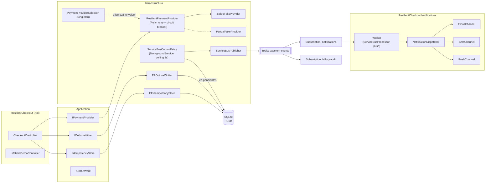

# ResilientCheckout

Proyecto personal de portafolio construido para reforzar, con código real y no solo teoría, cuatro puntos que salieron débiles en una entrevista técnica (lifetimes de DI, resiliencia con Polly, Circuit Breaker, y Azure Service Bus) junto con patrones que ya se dominaban pero vale la pena demostrar con un caso concreto (idempotencia, Transactional Outbox, Strategy).

El dominio es deliberadamente simple — un endpoint de cobro con proveedores de pago falsos — para que la complejidad esté toda en la infraestructura de resiliencia y mensajería, que es el objetivo real del ejercicio.

## Arquitectura

Clean Architecture con cuatro proyectos más uno adicional:

- **`ResilientCheckout.Domain`** — cero dependencias externas. Entidades (`PaymentResult`, `OutboxMessage`, `IdempotencyRecord`), y las abstracciones que el propio dominio necesita expresar (`IPaymentProvider`, `PaymentProviderUnavailableException`).
- **`ResilientCheckout.Application`** — referencia solo a Domain. Comandos (`ChargeCardCommand`) y las abstracciones de infraestructura que Application necesita pero no implementa (`IIdempotencyStore`, `IOutboxWritter`, `IUnitOfWork`, `IEventPublisher`).
- **`ResilientCheckout.Infraestructure`** — referencia a Application y Domain. Todas las implementaciones concretas: EF Core, Polly, Azure Service Bus, los proveedores de pago falsos.
- **`ResilientCheckout` (`ResilientCheckout.Api.csproj`)** — referencia a los tres anteriores. Composition root: controllers, `Program.cs` con todo el registro de DI.
- **`ResilientCheckout.Notifications`** — proceso separado (Worker Service). Solo referencia a Domain (los contratos `INotificationChannel`/`NotificationRequest`) — nunca a Application ni a Infraestructura, porque no comparte nada del flujo de checkout, solo consume eventos ya publicados.

## Cómo correrlo localmente

1. **Emulador de Azure Service Bus** (Docker): `docker compose up -d` desde la raíz del repo. Levanta el emulador oficial + su SQL Edge de respaldo, con el Topic `payment-events` y las Subscriptions `notifications`/`billing-audit` ya definidas en `servicebus-emulator/Config.json`.
2. **Migraciones de EF Core** (si es la primera vez, o si cambiaron las entidades): `dotnet ef database update --project ResilientCheckout.Infraestructure --startup-project ResilientCheckout`.
3. **Api**: `dotnet run --project ResilientCheckout`.
4. **Worker de notificaciones** (proceso separado, terminal aparte): `dotnet run --project ResilientCheckout.Notifications`.
5. **Tests**: `dotnet test` (o Test Explorer en Visual Studio).

Para depurar ambos procesos (Api + Notifications) a la vez desde Visual Studio, usa *Configure Startup Projects* y marca los dos como *Start* — pero para poder detener solo uno (como en la demo de "el mensaje nunca se pierde", más abajo) es más práctico correrlos en dos terminales independientes con `dotnet run`.

## Endpoints principales

| Endpoint | Qué hace |
|---|---|
| `POST /api/checkout/{orderId}/charge` | Cobra una orden. Requiere header `Idempotency-Key`. |
| `POST /api/simulation/{mode}` | Cambia el modo del proveedor de pago falso ACTIVO: `Success`, `TransientFailure`, `PersistentFailure`. |
| `POST /api/simulation/provider/{provider}` | Cambia en caliente cuál proveedor está activo: `Stripe` o `Paypal`. |
| `GET /api/lifetime-demo` | Compara Singleton/Scoped/Transient con Guids reales — ver sección de lifetimes abajo. |

## Decisiones de arquitectura y por qué

### Domain no puede depender de Application

`IPaymentProvider` originalmente recibía un `ChargeCardCommand` (tipo de Application) — eso forzaba a Domain a referenciar Application, invirtiendo la dirección de dependencia que Clean Architecture exige. Se corrigió creando `ChargeInstruction`, un DTO mínimo dentro de Domain con solo lo que el proveedor de pago necesita (`OrderId`); `ChargeCardCommand.ToChargeInstruction()` hace el mapeo del lado de Application, que sí puede conocer a Domain.

### Idempotencia: reservar primero, no revisar-y-luego-actuar

La primera versión revisaba "¿existe esta key?" y, si no, la creaba — clásica condición de carrera entre el chequeo y la escritura bajo carga concurrente. Se rediseñó como *reserve-first*: `TryReserveAsync` intenta insertar directamente y deja que la restricción unique de la base de datos (`Key` como llave primaria) sea el árbitro. Si otra request ya reservó esa key, `SaveChangesAsync` lanza `DbUpdateException`, que se atrapa y se traduce en `false`. La base de datos decide, no una condición en memoria que puede perder la carrera.

Además, la key solo se libera (`ReleaseAsync`) cuando la operación **nunca se completó de verdad** (circuito abierto, proveedor no disponible tras reintentos) — nunca cuando el resultado fue un rechazo de negocio (`Succeed = false`). Un rechazo de negocio es un desenlace válido y la key debe seguir consumida; una falla técnica no debería quemar la posibilidad de reintentar con la misma key.

### Transactional Outbox + Unit of Work

Escribir el registro de idempotencia, el `OutboxMessage` y confirmar el cobro son tres operaciones que deben ser atómicas: si una falla, ninguna debe persistir. `IUnitOfWork` abstrae un solo `SaveChangesAsync()` sobre el mismo `AppDbContext` Scoped compartido por toda la request — la garantía real de atomicidad la da EF Core (su `DbContext` ya es un Unit of Work), pero la interfaz desacopla a Application/Api de conocer EF Core directamente.

El outbox resuelve el problema de "¿cómo garantizo que el evento de pago exitoso se publica, incluso si el broker de mensajería está caído en ese instante?" — el evento se guarda en la misma transacción que el resto del cobro, y un proceso aparte (`ServiceBusOutboxRelay`) se encarga de sacarlo hacia Service Bus cuando pueda.

### Polly: retry + circuit breaker combinados

`ResiliencePolicies.CreatePaymentProviderPipeline` combina ambas estrategias en un solo `ResiliencePipeline<PaymentResult>` (Polly v8, no la v7 basada en `Policy`). Solo se reintenta y se cuenta como falla `PaymentProviderUnavailableException` — una excepción propia y controlable — nunca `Exception` genérica, porque eso incluiría bugs reales de programación que no deberían reintentarse ni abrir el circuito. Un rechazo de negocio (`Succeed = false`) tampoco cuenta como falla para Polly: técnicamente el proveedor respondió bien, solo que dijo "no".

### Strategy real: Paypal seleccionable en runtime (y limpieza de dominio muerto)

`PaypalFakeProvider` existía desde M1 pero nunca se registraba — código muerto que solo probaba que `IPaymentProvider` *podía* tener una segunda implementación, no que realmente la tuviera. Se resolvió con `PaymentProviderSelection` (Singleton, mismo criterio que `PaymentSimulationOptions`): guarda cuál proveedor está activo, arranca con el valor de `appsettings.json` (`Payments:Provider`) y se puede cambiar en caliente vía `POST /api/simulation/provider/{provider}`, sin reiniciar la app. El factory de `IPaymentProvider` en `Program.cs` lee esa selección y decide cuál fake concreto envolver con el decorator de Polly — la resiliencia es indiferente a cuál proveedor hay detrás, porque decora la interfaz, no una clase concreta. Ahora sí es un Strategy demostrable: dos implementaciones reales, intercambiables sin recompilar.

De paso se dio de baja `ResilientCheckout.Domain/Orders/` (`Order`, `OrderStatus`): una entidad completa que nunca se persistía (sin `DbSet`, sin migración, sin controller) y cuyo único punto de contacto era una propiedad de navegación en `PaymentResult` que las fakes jamás llenaban — dominio modelado al inicio que quedó huérfano. Se eliminó junto con la propiedad `PaymentResult.Order`.

### DI lifetimes — el hilo conductor de todo el proyecto

- **Scoped**: `AppDbContext` y todo lo que depende directamente de él (`EFIdempotencyStore`, `EFOutboxWritter`, `EFUnitOfWork`, `ResilientPaymentProvider`/`StripeFakeProvider`) — cada request necesita su propio change tracker aislado.
- **Singleton**: el `ResiliencePipeline<PaymentResult>` de Polly (el circuit breaker guarda su estado — Closed/Open/Half-Open — *dentro* del pipeline; uno nuevo por request jamás podría abrir el circuito), `ServiceBusClient`/`IEventPublisher` (mantienen la conexión AMQP viva), y `PaymentSimulationOptions` (el estado de la simulación debe sobrevivir entre requests para poder forzar fallas desde otro endpoint).
- **`BackgroundService` es Singleton aunque nadie lo declare así** — lo instancia el host una sola vez para toda la vida de la app. Por eso `ServiceBusOutboxRelay` no puede recibir `AppDbContext` directo en el constructor; usa `IServiceScopeFactory` para abrir un scope nuevo en cada ciclo de polling.
- `GET /api/lifetime-demo` hace esta distinción tangible: pide cada lifetime dos veces en la misma request y compara Guids. Singleton y Scoped salen iguales *dentro* de una request; solo Scoped cambia *entre* requests; Transient nunca es igual, ni siquiera dentro de la misma request.

### Service Bus: relay pull-based vs. worker push-based

`ServiceBusOutboxRelay` hace *polling* — cada 3 segundos pregunta a la base de datos qué mensajes están pendientes y los publica al Topic `payment-events`. `ResilientCheckout.Notifications` (proceso separado) es *push* — se suscribe con `ServiceBusProcessor` a la Subscription `notifications` y Azure Service Bus le entrega los mensajes en cuanto llegan, vía el evento `ProcessMessageAsync`. Son dos mecanismos de entrega distintos resolviendo dos mitades del problema de "at-least-once": el outbox garantiza que el evento *sale* de la base de datos aunque el broker esté caído un instante; la Subscription garantiza que el evento *le llega* al consumidor aunque este haya estado caído un rato — comprobado apagando el worker, cobrando, y confirmando que el mensaje seguía ahí al reiniciarlo.

`AutoCompleteMessages = false` en el processor es deliberado: el worker decide explícitamente cuándo completar (éxito) o abandonar (falla → Service Bus reentrega, hasta `MaxDeliveryCount` veces antes de mandarlo a la dead-letter queue).

`NotificationDispatcher` recibe `IEnumerable<INotificationChannel>` — el contenedor de DI junta automáticamente las tres implementaciones (`EmailChannel`, `SmsChannel`, `PushChannel`) registradas bajo esa interfaz. Agregar un cuarto canal es una línea de registro en `Program.cs`, cero cambios en el dispatcher (Strategy pattern).

### Un bug real: enums y `System.Text.Json`

`System.Text.Json` serializa enums como su valor numérico por defecto (`PaymentProvider.Stripe` → `0`), no como texto. El payload del outbox se serializaba así, y el worker de notificaciones (que esperaba `"Provider"` como string) tronaba al deserializar. La solución no fue parchar el consumidor para aceptar números — fue corregir al productor (`EFOutboxWritter`) para que serialice enums como string (`JsonStringEnumConverter`), porque ese mismo payload también alimenta la Subscription `billing-audit`: un número ahí es indescifrable sin el enum a la mano, y es frágil (reordenar el enum cambiaría en silencio el significado de eventos ya guardados). Buen recordatorio de que un contrato de mensaje mal pensado en el productor se manifiesta como un bug en el consumidor, no donde está la causa real.

## Testing: Mock, Stub y Fake — a propósito, no por accidente

`ResilientCheckout.Tests` (xUnit + Moq) usa deliberadamente los tres tipos de test double, cada uno donde tiene sentido y no donde "ya se usaba Moq para todo":

- **Fake** (`EFIdempotencyStoreFakeTests`) — SQLite en memoria como reemplazo funcional y ligero de la base real. `EFIdempotencyStore` corre sin modificar; lo que cambia es su dependencia externa. Cada "request" simulada usa su propio `AppDbContext` (mismo criterio de Scoped que en producción) — reusar uno solo entre dos "requests" esconde el bug real detrás de un error distinto (conflicto de identity resolution en el change tracker en vez de la `DbUpdateException` de negocio).
- **Stub** (`CheckoutControllerStubTests`) — `StubPaymentProvider` regresa siempre la misma respuesta enlatada; a nadie le importa cómo se le llamó. Sirve para aislar el resto del flujo del controller sin depender de si el pago "salió bien" de verdad.
- **Mock** (`CheckoutControllerMockTests`) — Moq verificando interacciones que un Stub no puede probar: que `IPaymentProvider.ChargeAsync` **nunca se llama** cuando la reserva de idempotencia falla (`Times.Never`), y que el outbox y el unit of work se invocan exactamente una vez tras un cobro exitoso.

## Próximos pasos (opcional)

M6, no implementado: patrón Saga con transacción compensatoria, para un flujo que involucre más de un paso que pueda fallar a mitad de camino y necesite deshacerse explícitamente.
